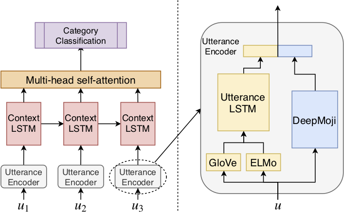

# ANA at SemEval-2019 Task 3 
[](https://pytorch.org/)
[](https://opensource.org/licenses/MIT) 

**News!** Our paper is selected as the oral presentation for the *SemEval-2019: task 3*. 

This repo contains the code for our [paper](https://arxiv.org/abs/1904.00132),
 
 **ANA at SemEval-2019 Task 3: Contextual Emotion detection in Conversations through hierarchical LSTMs and BERT**
 
 The paper will appear on the *The 13th International Workshop on Semantic Evaluation collocated with NAACL, Minneapolis, USA 2-7 June, 2019.* For now it is available on arxiv:

```
@article{huang2019ana,
  title={ANA at SemEval-2019 Task 3: Contextual Emotion detection in Conversations through hierarchical LSTMs and BERT},
  author={Huang, Chenyang and Trabelsi, Amine and Za\"{i}ane, Osmar R},
  journal={arXiv preprint arXiv:1904.00132},
  year={2019}
}
```
### What is ANA?

[Automated Nursing Agent (ANA)](https://www.amii.ca/ana-automated-nanny-agent/) is a project founded by [Alberta Machine Intelligence Institute (AMII)](https://www.amii.ca/). For more details, please visit the webpages.

### An graphical overview of the proposed *HRLCE* Model:



HRLCE is a single model that can achieve a score of 0.7666 on the final test set while only using the training dataset. 

We also finetune the *BERT-LARGE* model on this task. The results of BERT and HRLCE are combined to get the 0.7709 which ranked at 5th on the leaderboard of SemEval 2019 Task3. 

You can find the leaderboard from [CodaLab](https://competitions.codalab.org/competitions/19790#learn_the_details-data-set-format).
 
## Instructions
PyTorch1.0 with Python 3.6 serve as the backbones of this project.

The code is using one GPU by default, you have to modify the code to make it running on CPU or multiple GPUs.

The code includes more features than what has been described in the paper. For example, we experimented with multi-task learning and focal loss, but we found no significant difference.

To run the code, you have to specify the path to the *glove.840B.300d.txt* model file in *-glovepath* argument option. Other options are configured with some default value. 
In our experience, the *learning rate* and *decay* would have more impact than others.

You have to download the DeepMoji pretrain model if you haven't used it before. 
I am using the implementation by Hugginface (https://github.com/huggingface/torchMoji).

To avoid the conficts of some packages, I suggest using the fork from me directly (https://github.com/chenyangh/torchMoji.git).
Following the instructions for installation and download the model by the following script (under the direcory of their repo):

```
git clone https://github.com/chenyangh/torchMoji.git
cd torchMoji
pip install -e .
python scripts/download_weights.py
```
I can not include it in my repo because it exceeds the size limit of GitHub.


## Performance
The results are shown in the following table:

|        | Macro-F1 |   Happy  |   Angry  |    Sad   | Harm. Mean  |
| ------ | :------: | :------: | :------: | :------: | :---------: |
| *SL*   |   Dev  <br/>  Test  |  0.6430  <br/>  0.6400  |  0.7530 <br/>  0.7190 |  0.7180  <br/> 0.7300  |  0.7016  <br/> 0.6939    |
| *SLD*   |   Dev  <br/>  Test  |  0.6470  <br/>  0.6350  |  0.7610 <br/>  0.7180 |  0.7360  <br/> 0.7360  |  0.7112  <br/> 0.6934    |
| *HRLCE*   |   Dev  <br/>  Test  |  0.7460  <br/>  0.7220  |  0.7590 <br/>  0.7660 |  0.8100  <br/> 0.8180  |  **0.7706**  <br/> **0.7666**    |
| *BERT*   |   Dev  <br/>  Test  |  0.7138  <br/>  0.7151  |  0.7736 <br/>  0.7654 |  0.8106  <br/> 0.8157  |  0.7638  <br/> 0.7631    |


Compared to HRLCE, we notice that BERT performs better on *Angry* but worse on *Happy*, therefore it makes sense to combine the results of these two. 

## NOTES
Another note, in order to get your submissions measured the same way as that from CodaLab, you will need to look at the harmonic mean of the three macro F1 scores of the three emotion categories. 
It is slightly different than using the micro F scores of the three emotion categories directly.

HRLCE itself was able to get into the top 10 while only using the *train* set. 

**Last but not least:** The *importance weight of samples* is a VERY important factor, for there is an inconsistency between the training data (*train* set) and the testing data (*dev* and *test* sets). We did not emphasis it on our paper (we did not have space left). Please refer to our paper to see how we reweight the training samples.

## Acknowledgement
This code is relying on the work of the following projects:

* [AllenNlp](https://github.com/allenai/allennlp)

* [torchMoji](https://github.com/huggingface/torchMoji)

* [pytorch-pretrained-BERT](https://github.com/huggingface/pytorch-pretrained-BERT) <= 0.5

* [ekphrasis](https://github.com/cbaziotis/ekphrasis)

Many thanks to my supervisor [Osmar R. Zaïane](http://webdocs.cs.ualberta.ca/~zaiane/) for supporting me working on this shared task. 
